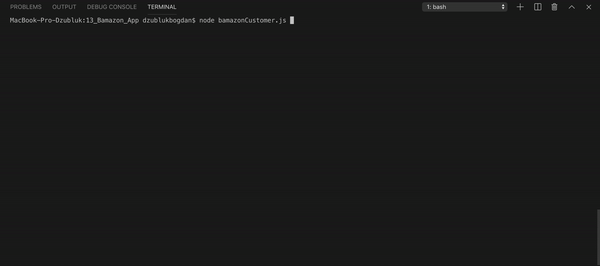

# BAMAZON APP

## Description
This application is a simple command line-based storefront using the npm inquirer package and the MySQL with the npm mysql package.

## MySQL Database Setup
In order to run this application, you should have the MySQL database already set up on your machine. You will be able to create the Bamazon database and the products table with the SQL code found in Bamazon.sql. Run this code inside your MySQL client to populate the database, then you will be ready to proceed with running the Bamazon customer interface.

## Customer Interface
The customer interface allows the user to view the current inventory of store items: item IDs, descriptions, department in which the item is located and price. The user is then able to purchase one of the existing items by entering the item ID and the desired quantity. If the selected quantity is currently in stock, the user's order is fulfilled, displaying the total purchase price and updating the store database. If the desired quantity is not available, the user is prompted to modify their order.

## Instructions
1. git clone https://github.com/dziubliukbm/13_Bamazon_App
2. cd bamazon
3. npm install
4. node bamazonCustomer.js